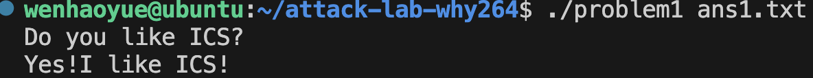
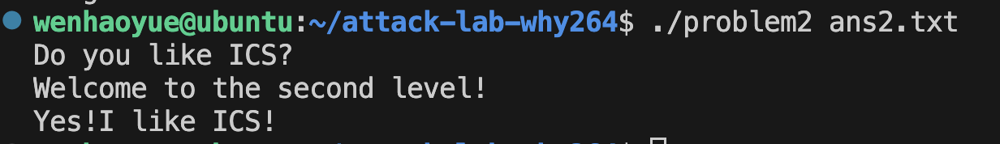
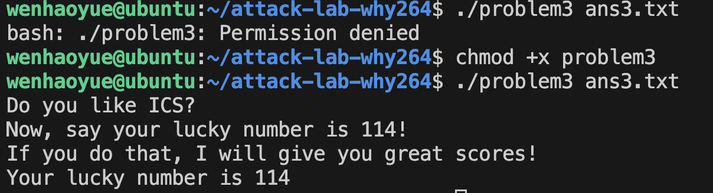

# 栈溢出攻击实验


## 题目解决思路

本次实验包含四个逐步进阶的题目，虽然各题涉及的保护机制（如 NX、ASLR、Canary）不同，但我采用了一套标准化的“静态分析—计算偏移—构造 Payload—验证”的流程来逐一攻克。

### 1. 静态分析与目标确定 (Static Analysis)

首先，我统一使用 `objdump -d` 命令将二进制文件反汇编，通过阅读汇编代码来理解程序的内存布局和逻辑。

* **定位漏洞**：重点审查 `main` 函数及其调用的子函数（如 `func`），寻找 `strcpy`、`read`、`scanf` 等未严格检查输入长度的函数调用，确定栈溢出的发生位置。
* **识别保护**：通过观察汇编代码特征来判断保护机制。例如，看到 `pop %rdi; ret` 片段想到 ROP 攻击；看到 `mov %fs:0x28, %rax` 识别出 Canary 保护；看到栈指针被保存到全局变量识别出 ASLR 绕过线索。
* **确定目标**：明确题目要求，如输出特定字符串、跳转到 `func1` 或 `func2`，并记录下这些目标函数的入口地址。

### 2. 栈帧分析与偏移量计算 (Offset Calculation)

为了劫持控制流，必须精确计算从缓冲区起始位置到栈上“返回地址”的距离。
在 x86-64 架构中，栈帧布局通常为：`[缓冲区] -> [Saved RBP (8字节)] -> [返回地址]`。
我通过分析汇编中的 `lea -0x??(%rbp), %rax` 指令确定缓冲区相对于 `%rbp` 的偏移大小。
**计算公式**：`Padding 长度 = 缓冲区大小 + Saved RBP 大小 (8字节)`。
只有填满这段空间，接下来的数据才能准确覆盖到返回地址。

### 3. Payload 构造策略 (Exploit Construction)

计算出偏移量后，我使用 Python 脚本配合 `struct` 模块（处理小端序转换）来构造 Payload，针对不同题目采取不同策略：

* **Problem 1 (基础溢出)**：题目无特殊保护。直接构造 `Padding + 目标函数地址`，覆盖返回地址以跳转至 `func1`。
* **Problem 2 (NX 保护)**：栈不可执行。我利用 **ROP (Return Oriented Programming)** 技术，寻找 `pop %rdi; ret` Gadget，构造 `Padding + Gadget地址 + 参数 + 目标函数地址` 的链条，通过寄存器传参绕过检查。
* **Problem 3 (ASLR 动态栈)**：栈地址随机但可执行。我利用程序中保存栈指针的全局变量作为“蹦床”（Trampoline），构造 `Shellcode + Padding + 蹦床函数地址`，使程序跳回栈上执行自定义的机器码。
* **Problem 4 (Canary 保护)**：栈溢出会被检测。我通过逆向分析发现程序存在整数比较的逻辑漏洞，通过输入特定值（`-1`）触发后门逻辑，在不触发 Canary 报错的情况下绕过检查。

### 4. 攻击实施与验证 (Verification)

最后，生成二进制 Payload 文件（如 `ans.txt`）并输入目标程序。

* **权限处理**：在运行过程中，针对部分题目（如 Problem 3）提示权限不足的问题，我使用 `chmod +x` 命令赋予程序执行权限。
* **结果验证**：观察程序输出，若出现 "Yes! I like ICS!" 或 "Your lucky number is 114" 等预期字符串，则证明攻击成功。


### Problem 1:

* **分析**：
首先，我使用 `objdump -d problem1` 查看了反汇编代码。在 `func` 函数中，我发现程序调用了 `strcpy` 函数，且没有检查输入长度，确定这就是栈溢出漏洞所在。
接着计算偏移量：通过指令 `lea -0x8(%rbp),%rax` 可以看到缓冲区是从 `rbp-8` 开始的。因为 64 位系统的 Saved RBP 占用 8 字节，所以从缓冲区起始位置到返回地址（Return Address）的距离是 **8 (Buffer) + 8 (Saved RBP) = 16 字节**。
最后，我找到了目标函数 `func1`，它的地址是 `0x401216`，这个函数会输出题目要求的 "Yes!I like ICS!"。所以我的思路就是填充 16 字节垃圾数据，然后覆盖返回地址为 `0x401216`。
* **解决方案**：
我编写了一个 Python 脚本来生成 payload，代码如下：
```python
import struct

# 1. 构造 Padding
# 偏移量计算：Buffer(8) + Saved RBP(8) = 16
offset = 16
padding = b'A' * offset

# 2. 构造目标地址
# func1 的地址是 0x401216，使用 64 位小端序打包
target_address = struct.pack('<Q', 0x401216)

# 3. 拼接并写入文件
payload = padding + target_address
with open("ans1.txt", "wb") as f:
    f.write(payload)

```

* **结果**：
运行生成的 `ans1.txt` 后，程序成功跳转并输出了指定字符串：




### Problem 2:

* **分析**：
首先，通过 `objdump` 分析汇编代码，我发现目标函数 `func2`（地址 `0x401216`）与上一题不同。它在开头有一条指令 `cmpl $0x3f8, -0x4(%rbp)`，这意味着函数会检查第一个参数（`%edi`）是否等于 `0x3f8`（即十进制的 1016）。只有通过检查，才会输出 Flag。
由于题目开启了 NX 保护（栈不可执行），我不能使用 Shellcode。根据 x86-64 的调用约定，第一个参数需要通过 `%rdi` 寄存器传递。我在代码中找到了一个非常有用的 Gadget 函数 `pop_rdi`（地址 `0x4012c7`），其中包含 `pop %rdi; ret` 指令。
溢出点的分析与 Problem 1 类似，在 `func` 函数中，缓冲区起始于 `rbp-8`，加上 8 字节的 Saved RBP，偏移量依然是 **16 字节**。
因此，我的攻击链构造思路是：**填充 16 字节 Padding -> 覆盖返回地址为 `pop_rdi` 地址 -> 放入参数 `0x3f8` -> 放入 `func2` 地址**。程序会先跳到 `pop_rdi` 将栈上的 `0x3f8` 弹入 `%rdi`，然后返回跳转到 `func2`，此时参数已就位，成功通过检查。
* **解决方案**：
编写 Python 脚本 `solve_p2.py` 构造 ROP 链：
```python
import struct

# 1. 基础信息
padding_len = 16         
gadget_addr = 0x4012c7    
arg_val     = 0x3f8       
func2_addr  = 0x401216    

# 2. 构造 ROP Payload
#[16字节 Padding] + [8字节 pop_rdi地址] + [8字节 参数] + [8字节 func2地址]
payload = b'A' * padding_len
payload += struct.pack('<Q', gadget_addr) 
payload += struct.pack('<Q', arg_val)     
payload += struct.pack('<Q', func2_addr)  

# 3. 写入文件
with open("ans2.txt", "wb") as f:
    f.write(payload)

```


* **结果**：
运行 payload 后，程序输出了 "Welcome to the second level!" 和 "Yes!I like ICS!"，攻击成功。



### Problem 3:

* **分析**：
Problem 3 相比前两题难度明显提升。虽然题目提示“无保护”，意味着栈是可执行的（可以直接运行 Shellcode），但栈的地址是动态变化的（ASLR），这导致我们无法像 Problem 1 那样硬编码跳转地址。
通过 `objdump` 分析汇编代码，我发现了破局的关键：
1. **全局指针保存**：在 `func` 函数中，程序贴心地把当前的栈顶指针 `%rsp` 保存到了一个全局变量 `saved_rsp` 中。
2. **蹦床函数 (Trampoline)**：程序提供了一个 `jmp_xs` 函数（地址 `0x401334`）。它的逻辑是读取 `saved_rsp`，加上 0x10（刚好是缓冲区的起始偏移），然后跳转过去。这实际上是一个“蹦床”，能帮我们跳回栈上的缓冲区开头。
3. **Shellcode 构造**：既然跳回了栈上，我就需要在栈上准备好代码。目标函数 `func1` 要求参数为 114，所以我需要手写一段汇编代码（Shellcode）来实现 `func1(114)` 的调用。


**遇到的问题与解决**：
在尝试运行题目程序时，我遇到了 `bash: ./problem3: Permission denied` 的错误。检查后发现是文件缺乏执行权限，我使用命令 `chmod +x problem3` 为文件添加了执行权限，随后程序正常运行。
* **解决方案**：
我编写了 Python 脚本 `solve_p3.py`。思路是：将 Shellcode 放在缓冲区最前面，用垃圾数据填满剩余空间，最后将返回地址覆盖为 `jmp_xs` 的地址。
代码如下：
```python
import struct

# 1. 基础信息
# 缓冲区大小(32) + Saved RBP(8) = 40 字节
total_offset = 40
jmp_xs_addr  = 0x401334   # 蹦床函数，负责跳回栈上

# 2. 构造 Shellcode (机器码)
# 对应汇编逻辑: 
# mov rdi, 114 (0x72); 
# mov rax, 0x401216 (func1地址); 
# call rax
shellcode = b'\x48\xc7\xc7\x72\x00\x00\x00' + \
            b'\x48\xc7\xc0\x16\x12\x40\x00' + \
            b'\xff\xd0'

# 3. 拼接 Payload
# [Shellcode] + [Padding] + [jmp_xs 地址]
# 自动计算需要填充多少个 'A'
pad_len = total_offset - len(shellcode)
payload = shellcode + (b'A' * pad_len) + struct.pack('<Q', jmp_xs_addr)

# 4. 写入文件
with open("ans3.txt", "wb") as f:
    f.write(payload)

```


* **结果**：
解决权限问题并运行 payload 后，程序成功执行了栈上的 Shellcode，输出了 "Your lucky number is 114"。



### Problem 4:

* **分析**：
Problem 4 开启了 Canary (栈溢出保护) 机制，我首先通过 `objdump` 反汇编 `func` 函数确认了这一点。
1. **Canary 保护机制分析**：
在 `func` 函数的开头（地址 `0x136c`），程序执行了 `mov %fs:0x28, %rax` 和 `mov %rax, -0x8(%rbp)`。这两条指令从线程局部存储 (TLS) 中读取一个随机生成的数值（Canary），并将其存放在栈底（`rbp-8`，位于局部变量和返回地址之间）。
在函数即将返回时（地址 `0x140e`），程序执行 `sub %fs:0x28, %rax` 来检查栈上的这个值是否被修改。如果发生了栈溢出，这个随机值势必会被覆盖，导致检查失败并跳转到 `__stack_chk_fail`，从而终止程序。这说明传统的覆盖返回地址的方法在本题中失效。
2. **逻辑漏洞分析**：
由于无法溢出，我转向分析程序的执行逻辑。在 `main` 函数中，我发现程序进行了三次 `scanf` 输入操作。前两次输入（名字和喜好）对程序控制流没有显著影响。
关键在于第三次输入，它将数据传递给了 `func` 函数。在 `func` 内部（地址 `0x13df`），程序将输入的整数与 `-1` (`0xffffffff`) 进行比较。如果输入等于 `-1`，程序会进入一个耗时的循环计算（将 `-1` 递减至 `1`），循环结束后，程序会跳过 Canary 的检查逻辑，直接调用 `func1` 函数输出 Flag。


* **解决方案**：
本题不需要编写攻击脚本，通过逻辑绕过即可解决。
我直接运行程序 `./problem4`，并按照交互流程操作：
1. 当程序询问名字时，输入任意字符串（如 `wenhaoyue`）。
2. 当程序询问是否喜欢 ICS 时，输入任意字符串（如 `yes`）。
3. 当程序提示 "give me enough yuanshi" 时，输入 **`-1`**。
4. 等待程序完成内部循环计算（约数十秒），即可获得通关提示。


* **结果**：
输入 `-1` 并等待一段时间后，程序输出了 "great!I will give you great scores"，验证攻击成功。


## 思考与总结


本次实验通过四个逐步进阶的题目，系统地模拟了栈溢出攻击的多种场景。从最基础的返回地址覆盖，到应对 NX（不可执行）、ASLR（地址随机化）和 Canary（栈保护）等现代安全防御机制，我深入理解了二进制程序漏洞的成因和怎么利用。

###  对栈溢出原理与攻击技术的深入理解

通过这四个题目的实践，我掌握了以下核心技术点：

* **栈帧结构的破坏（Problem 1）**：这是所有栈溢出的基础。我理解了函数调用时栈内存的布局，即“局部变量缓冲区”与“返回地址”是相邻存储的。只要输入数据超过缓冲区大小，就可以覆盖返回地址，从而将程序的控制流劫持到任意位置。
* **绕过 NX 保护与 ROP 技术（Problem 2）**：当栈内存被标记为不可执行时，无法直接运行注入的代码。我学习了 ROP 技术，即利用程序中已有的代码片段（，配合 x86-64 的寄存器传参规则（如使用 `pop rdi`），来构造调用链，从而绕过执行权限的限制。
* **动态地址与 Shellcode 注入（Problem 3）**：在地址随机化的场景下，栈地址不再固定。我学会了利用程序中保存的全局指针作为定位点，动态地计算跳转地址，从而成功执行注入在栈上的 Shellcode。
* **Canary 保护与逻辑漏洞（Problem 4）**：Canary 机制通过在栈底放置随机数来检测缓冲区溢出。本题让我认识到，当内存破坏难以实现时，逆向分析程序的业务逻辑同样重要。通过发现代码中的整数比较漏洞，可以在不触发 Canary 检查的情况下实现攻击目标。


###  对系统安全的认识

我深刻体会到了 `strcpy`、`gets` 等C语言标准库函数的潜在危险，它们缺乏边界检查是导致缓冲区溢出的直接原因。同时，我也认识到 NX、Canary 等保护机制在提升软件安全性方面的重要作用。以及栈溢出攻击对数据的精度要求极高。必须准确计算缓冲区大小以及 Saved RBP 的长度，才能确保 Payload 精确覆盖到返回地址。还有Python 脚本在构造 Payload 时起到了重要作用，特别是利用 `struct` 库处理内存地址的小端序转换，避免了手动构造二进制数据的错误。作为开发者，应当遵循安全编码规范，从源头上避免此类漏洞的产生。

## 参考资料

列出在准备报告过程中参考的所有文献、网站或其他资源，确保引用格式正确。
